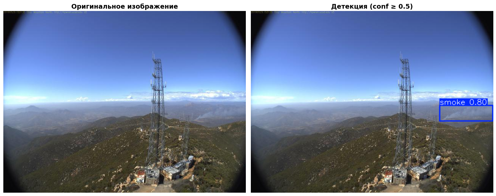
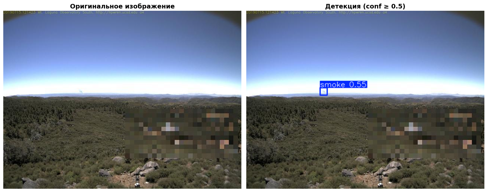

# Детектор лесных пожаров на основе компьютерного зрения (WildFire Detection System)

Система автоматического обнаружения лесных пожаров с использованием архитектуры YOLO. Проект решает актуальную экологическую задачу раннего предупреждения для минимизации ущерба лесным экосистемам.

## 📊 Ключевые характеристики
- **Модель:** YOLOv11x (самая крупная и точная версия YOLO на момент разработки)
- **Датасет:** WildFire_Smoke_Dataset_YOLO
- **Обучение:** 100 эпох в Google Colab с использованием GPU
- **Метрика качества:** mAP@0.5 = 0.902

## 📁 Структура проекта
```plaintext
practice/
├── data/                   # Данные 
│   ├── test/
│   ├── train/
│   ├── valid/
│   └── data.yaml
├── notebooks/              # Jupyter ноутбуки обучения и тестирования  
│   ├── example.ipynb
│   └── train.ipynb
├── test_images/            # Примеры работы модели 
│   ├── output1.png
│   └── output2.png
└── README.md
```

## 🖼️ Примеры работы модели


